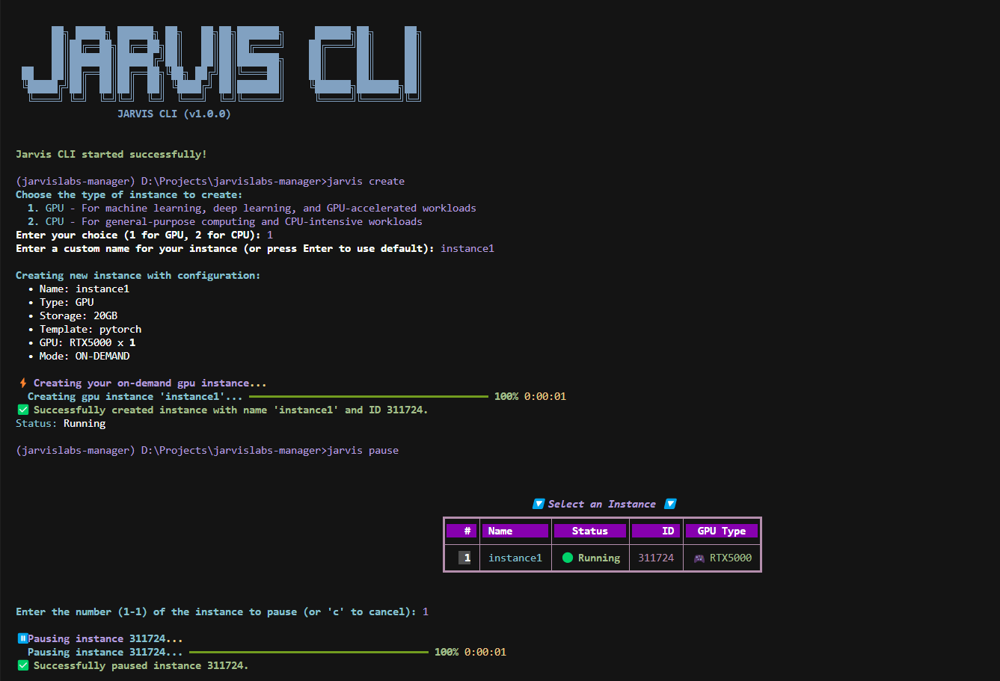

# Jarvis CLI


A powerful, terminal-based tool to manage your [Jarvislabs.ai](https://jarvislabs.ai/) instances, account, and filesystems.

This tool allows you to create, list, pause, resume, and destroy your instances, check your account balance, and manage persistent filesystems directly from the command line. It is built with Python and uses the `rich` library to provide clean, readable output.




## Features

- **Full Instance Lifecycle**: Create, list, pause, resume, and destroy instances.
- **Interactive Commands**: Many commands are interactive, guiding you through the process.
- **On-the-Fly Modification**: Modify instance resources like GPU type or storage when resuming.
- **Spot Instance Support**: Create cheaper spot instances with a simple flag.
- **Account Management**: Check your account balance and list available templates.
- **FileSystem Management**: Create, list, delete, and attach persistent filesystems to your instances.
- **Secure Authentication**: Your API token can be passed as an argument or set as an environment variable.
- **Command Overview**: Easily view all available commands and their descriptions with the `cmd` command.

## Installation

To use this tool, you first need to install it and its dependencies.

1.  **Create and activate a virtual environment (Recommended):**
    ```bash
    python -m venv venv
    source venv/bin/activate  # On Windows, use `venv\Scripts\activate`
    ```

2.  **Navigate to the tool's directory:**
    ```bash
    cd jarvislabs-manager
    ```

3.  **Install the tool in editable mode:**
    This command will install the necessary packages and create an entry point for the `jarvis` command.
    ```bash
    pip install -e .
    ```

## Authentication

The tool requires your Jarvislabs API token to authenticate. You can get your token from the Jarvislabs dashboard.

You can provide the token in two ways:

1.  **As a command-line argument:**
    Use the `--token` flag with any command:
    ```bash
    jarvis --token YOUR_API_TOKEN list
    ```

2.  **As an environment variable (Recommended):**
    Set the `JARVISLABS_TOKEN` environment variable. The tool will automatically pick it up.
    ```bash
    export JARVISLABS_TOKEN="YOUR_API_TOKEN"
    ```
    You can add this line to your shell's startup file (e.g., `.bashrc`, `.zshrc`) to make it permanent.

3.  **For Windows Command Prompt users:**
    Set the environment variable in Command Prompt:
    ```cmd
    set JARVISLABS_TOKEN=YOUR_API_TOKEN
    ```
    
    For a permanent setting in Windows, set the environment variable through System Properties:
    ```cmd
    setx JARVISLABS_TOKEN "YOUR_API_TOKEN"
    ```
    Note: After using `setx`, you'll need to open a new Command Prompt window for the change to take effect.

## Usage

Once installed, you can use the `jarvis` command with the following subcommands.

### Getting Started

**Start the manager with welcome banner:**
```bash
jarvis start
```

**View all available commands:**
```bash
jarvis cmd
```

**Exit the manager with goodbye message:**
```bash
jarvis exit
```

### Account Management

**Check your balance:**
```bash
jarvis balance
```

**List available framework templates:**
```bash
jarvis templates
```

### Instance Management

**List all your instances:**
```bash
jarvis list
```

**Create a new instance:**
The create command is interactive. If you run it without arguments, it will guide you.
```bash
jarvis create
```
You can also specify parameters, such as creating a spot instance:
```bash
jarvis create --instance-type gpu --name "My-Spot-Instance" --spot
```

#### GPU Instance Examples

Here are examples of creating instances with specific GPU configurations:

**Create an RTX5000 instance (24GB VRAM):**
```bash
jarvis create --instance-type gpu --gpu-type RTX5000
```

**Create a dual A100 instance (2x80GB VRAM):**
```bash
jarvis create --instance-type gpu --gpu-type A100 --num-gpus 2
```

**Create an A6000 instance (48GB VRAM):**
```bash
jarvis create --instance-type gpu --gpu-type A6000
```

**Create a V100 spot instance (16GB VRAM) with PyTorch:**
```bash
jarvis create --instance-type gpu --gpu-type V100 --template pytorch --spot
```

**Create an instance with specific storage and TensorFlow:**
```bash
jarvis create --instance-type gpu --gpu-type RTX5000 --storage 50 --template tensorflow
```

**Full list of create options:**

| Option | Description | Default |
|--------|-------------|---------|
| `--instance-type` | Type of instance (gpu or cpu) | None (interactive) |
| `--gpu-type` | GPU type (RTX5000, A100, V100, etc.) | RTX5000 |
| `--num-gpus` | Number of GPUs | 1 |
| `--num-cpus` | Number of CPUs | 1 |
| `--storage` | Storage size in GB | 20 |
| `--name` | Name for the instance | My-Jarvis-Instance |
| `--template` | Framework template | pytorch |
| `--spot` | Request spot instance (cheaper but can be terminated) | False |
| `--fs-id` | Attach a filesystem by ID | None |

**Pause a running instance:**
```bash
jarvis pause INSTANCE_ID
```

**Resume a paused instance:**
```bash
jarvis resume INSTANCE_ID
```
You can also modify an instance when resuming it:
```bash
jarvis resume INSTANCE_ID --storage 50 --gpu-type RTX6000Ada
```

**Destroy an instance:**
This command is interactive and will prompt for confirmation.
```bash
jarvis destroy
```
You can also specify the ID directly:
```bash
jarvis destroy INSTANCE_ID
```

### FileSystem Management

**List your filesystems:**
```bash
jarvis fs list
```

**Create a new filesystem:**
```bash
jarvis fs create my-dataset 100
```
*Creates a 100GB filesystem named `my-dataset`.*

**Delete a filesystem:**
```bash
jarvis fs delete FS_ID
```

**Attach a filesystem to an instance:**
Use the `--fs-id` flag when creating or resuming an instance.
```bash
jarvis create --fs-id your-fs-id
jarvis resume INSTANCE_ID --fs-id your-fs-id
```

## License

This project is licensed under the terms of the MIT license. 